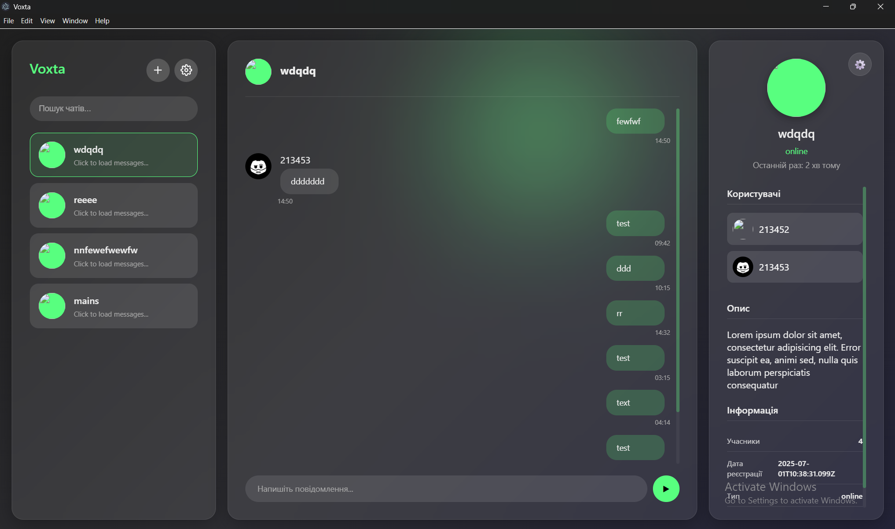

# 🚀 Voxta

> **Hybrid messenger for the modern world. Powered by privacy, flexibility, and control.**

---

## 🧩 About This Project

**Voxta** is a hybrid messenger that supports both **online** and **offline** communication.

- 🟢 **Online chats** are stored securely on Voxta servers.
- 🟡 **Offline chats** are stored locally on the client and work even without permanent server connection.
- 🔐 Supports **three encryption modes**:  
  - **Simple**  
  - **Server-based**  
  - **Secure (Signal protocol)**

Users can even **deploy their own Voxta servers** and configure message routing through Voxta with storage on **private infrastructure**.  
Voxta is built to serve both **individuals** and **organizations** who demand **control**, **privacy**, and **scalability**.

---

## ✨ Key Features

- 🌐 Hybrid chat system (online + offline)
- 🔐 Flexible encryption (Simple / Server / Signal-based)
- 🗄️ Local and remote chat storage
- 🧑‍💻 Self-hostable server support
- 🚀 Modern tech stack (Node.js, TypeScript, Java, Electron.js, Go)
- 🛠️ Modular and extensible architecture
- 👥 Designed for both personal and enterprise use

---

## 🛠️ Tech Stack

| Technology   | Role                         |
|--------------|------------------------------|
| **Node.js**  | Backend logic, API           |
| **TypeScript** | Frontend / Backend type safety |
| **Java**     | Cryptographic services / Server-side |
| **Electron.js** | Desktop application interface |
| **Golang**   | Performance-critical services / Microservices |

---

## 📣 Stay Connected

Follow updates and releases:

- 🌐 Website: [voxta.app](https://voxta.app) *(none)*

---

> _213452._
